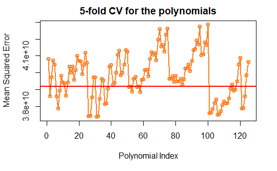

# House Prices in King County, Washington
#### *Moises Daniel Garcia Rojas*
#### *June 10, 2019*
#### *Code: House_Data/HD.Rmd*

## Introduction

Economic theory tells us that house prices are based on a variety of features. The file (kc house data.csv) contains a data set with house sale prices for homes in King County, Washington that were sold between May 2014 and May 2015. King County has its seat in Seattle and it is the most populous county in Washington, and the 13th-most populous in the United States.

The data set comprises 19 different features. The general goal is to predict house prices (price) using all the available predictors, except the case identifying information (i.e. id, date).


### Data Overview

Variable description:

* price : price of home in USD
* bedrooms: number of bedrooms in home
* bathrooms: number of bathrooms in home
* sqft living: living aerea (in sq.ft)
* sqft lot: lot size of the house (in sq.ft)
* floors: number of floors
* waterfront: Waterfront dummy variable (= 1 if home is at Waterfront; 0 other-wise)
* view: Scenic view dummy variable (= 1 if home has a scenic view; 0 otherwise)
* condition: condition of home
* grade: Classification by construction quality which refers to the types of materials used and the quality of workmanship, higher grade = higher quality
* sqft basement: size of the basement
* sqft above: sqft above = sqft living - sqft basement
* yr built: year in which house was built
* yr renovated: year in which house was renovated for the last time, `0' indicating that no major renovation took place
* zipcode: ZIP code
* lat: geographic latitude of location
* long: geographic longitude of location
* sqft living15: the average house square footage of the 15 closest houses
* sqft lot15: the average lot square footage of the 15 closest houses


### Summary Statistics

The statistics tell us that the there is a house with a minimum price of 75,000 USD, and a house with a maximum value of 7,700,000 USD, with a median value in prices equal to 450,000 USD, and mean value of 540,100 USD with a standard deviation of ± 367,127.2 USD.

```
  Min.  1st Qu.  Median    Mean   3rd Qu.   Max. 
 75000  321950   450000   540088  645000  7700000
  
   SD
367127.2
```


### Data Split

Data is partitioned into 80% training and 20% testing.

The complete dataset contains 21,613 observations and 19 attributes, while the training set has 17,290, and the test set 4,323 observations.

Set| Observations | Attributes
:---|:---|:---
Complete |21,613 |19
Train | 17,290 | 19
Test | 4323 | 19

***
## Modeling


### Summary Statistics for the Training and Test Sets

As shown bellow, the `training set` contains a house with a minimum price of 75,000 USD, a house with a maximum value of 7,700,000 USD, with a median value in prices equal to 450,000, mean of 540,400 USD, and a standard deviation of ± 372,395.9 USD.

The `test set` contains a house with a minimum price of 95,000 USD, a house with a maximum value of 5,300,000 USD, a median equal to 455,000 USD, a mean of 539,000 USD, and a standard deviation of ± 345,291.1 USD.

#### Summary - Training Set

```
 Min.  1st Qu.  Median   Mean   3rd Qu.   Max. 
75000  320000   450000  540356  643000  7700000

   SD
372395.9
```

#### Summary - Test Set

```
 Min.  1st Qu.  Median   Mean   3rd Qu.   Max. 
95000  329974   455000  539019  650000  5300000 

   SD
345291.1
```

### Linear Model

The model is moderately adjusted as indicated by the R-squared, which means that the model explains about 69.9 % of the variability in house prices.

For the predictor floor we can’t reject the null hypothesis, because the value of the standard error (4.090e+03) is in the same range as the coefficient (5.500e+03), therefore its t-value is 0.1787. Even though the t value is not 0, assuming the Null hypothesis for floor and by looking at the p-value we know that we could obtain the observed difference or more in 17.87% of times due to random sampling error.

```
Call:
lm(formula = price ~ ., data = house.Train)

Residuals:
     Min       1Q   Median       3Q      Max 
-1126872   -99902    -9285    77576  4266327 

Coefficients: (1 not defined because of singularities)
                Estimate Std. Error t value Pr(>|t|)    
(Intercept)    7.798e+06  3.334e+06   2.339   0.0193 *  
bedrooms      -4.089e+04  2.250e+03 -18.176  < 2e-16 ***
bathrooms      4.349e+04  3.720e+03  11.692  < 2e-16 ***
sqft_living    1.564e+02  4.993e+00  31.336  < 2e-16 ***
sqft_lot       1.082e-01  5.302e-02   2.040   0.0414 *  
floors         5.500e+03  4.090e+03   1.345   0.1787    
waterfront     5.897e+05  1.956e+04  30.151  < 2e-16 ***
view           5.449e+04  2.419e+03  22.527  < 2e-16 ***
condition      2.681e+04  2.658e+03  10.088  < 2e-16 ***
grade          9.549e+04  2.445e+03  39.058  < 2e-16 ***
sqft_above     3.178e+01  4.934e+00   6.443 1.21e-10 ***
sqft_basement         NA         NA      NA       NA    
yr_built      -2.649e+03  8.224e+01 -32.211  < 2e-16 ***
yr_renovated   1.896e+01  4.142e+00   4.578 4.72e-06 ***
zipcode       -6.115e+02  3.757e+01 -16.278  < 2e-16 ***
lat            6.023e+05  1.220e+04  49.368  < 2e-16 ***
long          -2.297e+05  1.482e+04 -15.500  < 2e-16 ***
sqft_living15  1.961e+01  3.934e+00   4.983 6.30e-07 ***
sqft_lot15    -4.064e-01  8.342e-02  -4.872 1.11e-06 ***
---
Signif. codes:  0 ‘***’ 0.001 ‘**’ 0.01 ‘*’ 0.05 ‘.’ 0.1 ‘ ’ 1

Residual standard error: 204300 on 17272 degrees of freedom
Multiple R-squared:  0.6993,	Adjusted R-squared:  0.699 
F-statistic:  2362 on 17 and 17272 DF,  p-value: < 2.2e-16
```

### Automatic Forward/Backward Selection Method

The stepAIC in the backward/forward strategy has a score of 422843.1 for the best model. The significant predictors at 5% level are the following: sqft_living, lat, view, grade, yr_built, waterfront, bedrooms, bathrooms, zipcode, long, condition, sqft_above, sqft_lot15,  sqft_living15, yr_renovated and sqft_lot. The strategy removes Floors and sqft_basement. The AIC of the best resulting model is 422843.1 compared to 443583.3 of the starting model. The best model presents an improvement of 4.9 %.

#### Null Model
```
Start:  AIC=443583.3
price ~ 1

                Df  Sum of Sq        RSS    AIC
+ sqft_living    1 1.1788e+15 1.2188e+15 431887
+ grade          1 1.0609e+15 1.3367e+15 433483
+ sqft_above     1 8.7257e+14 1.5250e+15 435762
+ sqft_living15  1 8.2019e+14 1.5774e+15 436346
+ bathrooms      1 6.5977e+14 1.7378e+15 438021
+ view           1 3.8127e+14 2.0163e+15 440591
+ sqft_basement  1 2.5859e+14 2.1390e+15 441612
+ bedrooms       1 2.3877e+14 2.1588e+15 441772
+ lat            1 2.2373e+14 2.1739e+15 441892
+ waterfront     1 1.7029e+14 2.2273e+15 442311
+ floors         1 1.5401e+14 2.2436e+15 442437
+ yr_renovated   1 3.8726e+13 2.3589e+15 443304
+ sqft_lot       1 1.6079e+13 2.3815e+15 443469
+ sqft_lot15     1 1.4212e+13 2.3834e+15 443483
+ yr_built       1 5.7883e+12 2.3918e+15 443544
+ zipcode        1 5.5329e+12 2.3921e+15 443545
+ condition      1 3.4147e+12 2.3942e+15 443561
+ long           1 7.3083e+11 2.3969e+15 443580
<none>                        2.3976e+15 443583
```

#### Best Model
```
Step:  AIC=422843.1
price ~ sqft_living + lat + view + grade + yr_built + waterfront + 
    bedrooms + bathrooms + zipcode + long + condition + sqft_above + 
    sqft_lot15 + sqft_living15 + yr_renovated + sqft_lot

                Df  Sum of Sq        RSS    AIC
<none>                        7.2114e+14 422843
+ floors         1 7.5491e+10 7.2106e+14 422843
- sqft_lot       1 1.6964e+11 7.2131e+14 422845
- yr_renovated   1 9.0528e+11 7.2204e+14 422863
- sqft_living15  1 9.8731e+11 7.2212e+14 422865
- sqft_lot15     1 1.0092e+12 7.2215e+14 422865
- sqft_above     1 2.5746e+12 7.2371e+14 422903
- condition      1 4.2005e+12 7.2534e+14 422941
- bathrooms      1 6.4765e+12 7.2761e+14 422996
- long           1 1.0261e+13 7.3140e+14 423085
- zipcode        1 1.0987e+13 7.3212e+14 423103
- bedrooms       1 1.3870e+13 7.3501e+14 423170
- view           1 2.1261e+13 7.4240e+14 423343
- waterfront     1 3.7937e+13 7.5907e+14 423728
- sqft_living    1 4.3947e+13 7.6508e+14 423864
- yr_built       1 4.4632e+13 7.6577e+14 423879
- grade          1 6.4570e+13 7.8571e+14 424324
- lat            1 1.0298e+14 8.2412e+14 425149
```

#### Summary - Best Model

```
Call:
lm(formula = price ~ sqft_living + lat + view + grade + yr_built + 
    waterfront + bedrooms + bathrooms + zipcode + long + condition + 
    sqft_above + sqft_lot15 + sqft_living15 + yr_renovated + 
    sqft_lot, data = house.Train)

Residuals:
     Min       1Q   Median       3Q      Max 
-1129105   -99911    -9408    77533  4264826 

Coefficients:
                Estimate Std. Error t value Pr(>|t|)    
(Intercept)    7.024e+06  3.284e+06   2.139   0.0324 *  
sqft_living    1.544e+02  4.760e+00  32.444  < 2e-16 ***
lat            6.037e+05  1.216e+04  49.665  < 2e-16 ***
view           5.458e+04  2.418e+03  22.567  < 2e-16 ***
grade          9.578e+04  2.435e+03  39.327  < 2e-16 ***
yr_built      -2.625e+03  8.028e+01 -32.696  < 2e-16 ***
waterfront     5.895e+05  1.956e+04  30.144  < 2e-16 ***
bedrooms      -4.099e+04  2.249e+03 -18.227  < 2e-16 ***
bathrooms      4.478e+04  3.595e+03  12.455  < 2e-16 ***
zipcode       -6.069e+02  3.741e+01 -16.223  < 2e-16 ***
long          -2.314e+05  1.476e+04 -15.677  < 2e-16 ***
condition      2.662e+04  2.654e+03  10.031  < 2e-16 ***
sqft_above     3.473e+01  4.422e+00   7.853 4.30e-15 ***
sqft_lot15    -4.100e-01  8.338e-02  -4.917 8.88e-07 ***
sqft_living15  1.901e+01  3.909e+00   4.863 1.17e-06 ***
yr_renovated   1.926e+01  4.136e+00   4.657 3.24e-06 ***
sqft_lot       1.069e-01  5.302e-02   2.016   0.0438 *  
---
Signif. codes:  0 ‘***’ 0.001 ‘**’ 0.01 ‘*’ 0.05 ‘.’ 0.1 ‘ ’ 1

Residual standard error: 204300 on 17273 degrees of freedom
Multiple R-squared:  0.6992,	Adjusted R-squared:  0.6989 
F-statistic:  2510 on 16 and 17273 DF,  p-value: < 2.2e-16
```

### Residual´s Effects

From the images bellow, it seems that the attributes `sqft_living`, `bathrooms`, and `sqft_above` present non-linear effects. 
In the next step the **one-standard-error rule** is performed over the cross-validation of multiple polynomials using the three variables with non-linear effects. 


### The One-Standard-Error rule and 5-fold Cross Validation

For each of the three attributes (indicated in the previous step), separately, polynomials were added up to degree 5 using as basis the "best" model. 5-fold cross validation was run to evaluate which higher order polynomial of the three predictors should be included in the final model. Bellow is shown a plot of the mean squared errors of the cross-valdiation results against complexity of the model. The MSE and the one-standard-error rule were implemented to decide which higher order polynomials to include.

*NOTE: If taking a look in the code, the poynomials are added in an orderly manner. The MSEs are stored in the `MSE.Ply` variable list, with this list we can find the order of the polynoial. When executing `which.min(MSE.Ply)` we find that the polynomial with index 31 has the lowest MSE, and thus we find from the console output (when performing the cross-validation) that the model for this case has squared `sqft_living`, squared `bathrooms`, and `sqft_above` without power. The mean-squared errors for each validation-fold of this case can be found in the console output (which is what I did), or the model with this characteristics can be trained and cross-validated in order to find the individual MSEs*

The MSE values are *4.27e+10*, *3.8e+10*, *3.41e+10*, *3.93e+10*, *3.27e+10* and in the code they are stored in the `MSEk.31` vector



The simpler model within one standard error of the model with the lowest MSE has index 2. This model has a first degree of sqft_living, first degree of bathrooms and second degree of sqft_above in the best model.

### Test predictions Using the Most Parsimonious Model

```
"Root Mean Squared Error"
188936


Call:
lm(formula = .outcome ~ ., data = dat)

Residuals:
     Min       1Q   Median       3Q      Max 
-1129105   -99911    -9408    77533  4264826 

Coefficients:
               Estimate Std. Error t value Pr(>|t|)    
(Intercept)    7.02e+06   3.28e+06    2.14    0.032 *  
bedrooms      -4.10e+04   2.25e+03  -18.23  < 2e-16 ***
bathrooms      4.48e+04   3.59e+03   12.46  < 2e-16 ***
sqft_living    1.54e+02   4.76e+00   32.44  < 2e-16 ***
sqft_lot       1.07e-01   5.30e-02    2.02    0.044 *  
waterfront     5.90e+05   1.96e+04   30.14  < 2e-16 ***
view           5.46e+04   2.42e+03   22.57  < 2e-16 ***
condition      2.66e+04   2.65e+03   10.03  < 2e-16 ***
grade          9.58e+04   2.44e+03   39.33  < 2e-16 ***
sqft_above     3.47e+01   4.42e+00    7.85  4.3e-15 ***
yr_built      -2.62e+03   8.03e+01  -32.70  < 2e-16 ***
yr_renovated   1.93e+01   4.14e+00    4.66  3.2e-06 ***
zipcode       -6.07e+02   3.74e+01  -16.22  < 2e-16 ***
lat            6.04e+05   1.22e+04   49.67  < 2e-16 ***
long          -2.31e+05   1.48e+04  -15.68  < 2e-16 ***
sqft_living15  1.90e+01   3.91e+00    4.86  1.2e-06 ***
sqft_lot15    -4.10e-01   8.34e-02   -4.92  8.9e-07 ***
---
Signif. codes:  0 ‘***’ 0.001 ‘**’ 0.01 ‘*’ 0.05 ‘.’ 0.1 ‘ ’ 1

Residual standard error: 204000 on 17273 degrees of freedom
Multiple R-squared:  0.699,	Adjusted R-squared:  0.699 
F-statistic: 2.51e+03 on 16 and 17273 DF,  p-value: <2e-16
```

## Results Interpretation

As seen from the summary results, the best (cross-validated) model explains 69.9% of the variability of the data. Besides the residual standard error tells us that the predictions could vary within ± 204,000 USD from the actual values. 
The Root Mean Squared Error is 188, 936 USD, which is actually within the residual standard error. The RMSE tells us that the predictions are in general 188,936.1 USD away from the actual value.
